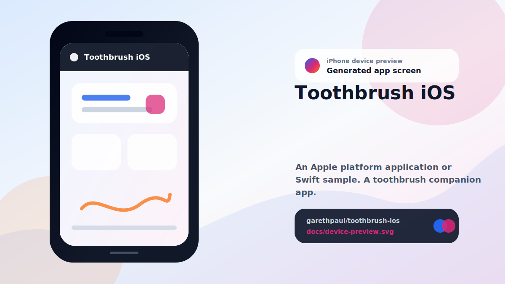

# toothbrush-ios

<!-- README-OVERVIEW-IMAGE -->


## Device Preview

<!-- DEVICE-PREVIEW-IMAGE -->


## Overview

`garethpaul/toothbrush-ios` is an Apple platform application or Swift sample. A toothbrush companion app. 

This README is based on the checked-in source, manifests, scripts, and repository metadata on the `master` branch. The project language mix found during review was: Swift (4).

## Repository Contents

- `README.md` - project overview and local usage notes
- `CHANGES.md` - maintenance history for timer and color checks
- `Makefile` - local verification entry points
- `docs/plans` - completed maintenance plans for the current baseline
- `img` - GIF behavior reference
- `plans` - historical implementation notes
- `scripts` - static project, timer, and color validators
- `SECURITY.md` - security reporting and disclosure guidance
- `toothbrush` - source or example code
- `toothbrush.xcodeproj` - Xcode project file
- `toothbrushTests` - source or example code
- `VISION.md` - project direction and maintenance guardrails

Additional scan context:

- Source directories: toothbrush, toothbrushTests
- Dependency and build manifests: none detected
- Entry points or build surfaces: toothbrush.xcodeproj
- Test-looking files: toothbrushTests/Info.plist, toothbrushTests/toothbrushTests.swift

## Getting Started

### Prerequisites

- Git
- macOS with Xcode 16.4 for building Apple platform projects
- Python 3 for repository source checks

### Setup

```bash
git clone https://github.com/garethpaul/toothbrush-ios.git
cd toothbrush-ios
```

The setup commands above are derived from repository files. Legacy mobile, Python, or JavaScript samples may require older SDKs or package versions than a modern workstation uses by default.

## Running or Using the Project

- Open `toothbrush.xcodeproj` in Xcode, choose the app or sample scheme, and run it on the matching simulator/device.

## Testing and Verification

- `make check` runs static project checks, timer lifecycle checks, hex color
  parser checks, and timer accessibility checks. When `xcodebuild` is
  installed, the `test` target executes the shared XCTest scheme on an iPhone
  16 Pro simulator and the `build` target compiles the app and XCTest target
  with code signing disabled. The project uses Swift 5 and an iOS 12 deployment
  target.
- Timer lifecycle checks also require teardown to invalidate timers and remove
  the custom navigation logo view. They also require view appearance to
  reattach the logo and view disappearance to stop an active timer through the
  shared reset path while removing the logo. The reset path must zero the
  countdown while keeping the timer label, accessibility value, and prompt
  visibility state in sync. The repeating countdown timer must also set a small
  scheduling tolerance, run in common run-loop modes, and capture the controller
  weakly so timer ownership cannot keep a departed screen alive. Navigation
  logo checks also require layout passes to recenter the custom logo.
- Countdown values are derived from a two-minute continuous monotonic deadline
  rather than callback count or the device wall clock, with XCTest coverage
  for delayed callbacks and expired deadlines. The clock includes device sleep,
  and the bundled privacy manifest declares timer reason `35F9.1`. Foreground
  countdown reconciliation immediately refreshes an active timer when the app
  becomes active again.
- Static project checks also require completed canonical plans under `docs/plans`.
- The shared `toothbrush` scheme executes the color-parser and deadline XCTest
  assertions on the pinned simulator destination.
- GitHub Actions runs the Python static `make check` baseline on Ubuntu 24.04
  and executes the XCTest target with Xcode 16.4 on macOS 15. The
  workflow has read-only repository permissions, bounded jobs, concurrency
  cancellation, credential-free checkout, and commit-pinned Node 24 actions.
  Runtime UI verification still requires a simulator or device.

When the required SDK or runtime is unavailable, use static checks and source review first, then verify on a machine that has the matching platform toolchain.

## Configuration and Secrets

- No required secret or credential file was identified in the repository scan. If you add integrations later, keep secrets out of git.

## Security and Privacy Notes

- Review changes touching network requests, sockets, or service endpoints; examples from the scan include toothbrush/Info.plist, toothbrushTests/Info.plist.
- Review changes touching file, media, JSON, XML, CSV, OCR, or data parsing; examples from the scan include toothbrush/Info.plist, toothbrush/ViewController.swift, toothbrushTests/Info.plist.

## Maintenance Notes

- The checked-in baseline is Swift 5, Xcode 16.4, and iOS 12 or newer.
- See `SECURITY.md` for vulnerability reporting and safe research guidance.
- See `VISION.md` for project direction and contribution guardrails.
- See `docs/plans/2026-06-10-swift-5-xcode-build.md` for the modern Xcode build
  baseline.
- See `docs/plans/2026-06-08-toothbrush-ios-baseline.md` for the canonical
  timer and color validation baseline.
- See `docs/plans/2026-06-08-timer-accessibility.md` for timer accessibility
  label coverage.
- See `docs/plans/2026-06-08-navigation-logo-teardown.md` for navigation logo
  teardown coverage.
- See `docs/plans/2026-06-09-view-disappear-timer-reset.md` for the
  view-disappear timer reset guard.
- See `docs/plans/2026-06-09-reset-label-sync.md` for the shared reset label
  synchronization guard.
- See `docs/plans/2026-06-09-prompt-alpha-reset.md` for the prompt reset-state
  guard.
- See `docs/plans/2026-06-09-timer-tolerance.md` for the countdown timer
  tolerance guard.
- See `docs/plans/2026-06-09-timer-run-loop-modes.md` for the countdown timer
  common run-loop mode guard.
- See `docs/plans/2026-06-09-navigation-logo-lifecycle.md` for the navigation
  logo appearance/disappearance guard.
- See `docs/plans/2026-06-09-navigation-logo-layout.md` for the navigation
  logo layout guard.
- See `docs/plans/2026-06-10-ci-baseline.md` for the GitHub Actions static
  contract gate.
- See `docs/plans/2026-06-10-deadline-countdown.md` for real-time countdown
  calculation and delayed-tick XCTest coverage.
- See `docs/plans/2026-06-13-monotonic-countdown-deadline.md` for the
  wall-clock-independent countdown boundary.
- See `docs/plans/2026-06-13-foreground-countdown-reconciliation.md` for the
  foreground countdown reconciliation lifecycle contract.
- See `docs/plans/2026-06-12-hosted-xctest.md` for the shared scheme and hosted
  simulator test gate.
- See `docs/plans/2026-06-12-weak-timer-ownership.md` for weak callback capture
  that prevents the repeating timer from retaining its controller.

## Contributing

Keep changes small and tied to the project that is already present in this repository. For code changes, document the toolchain used, avoid committing generated dependency directories or local configuration, and update this README when setup or verification steps change.
